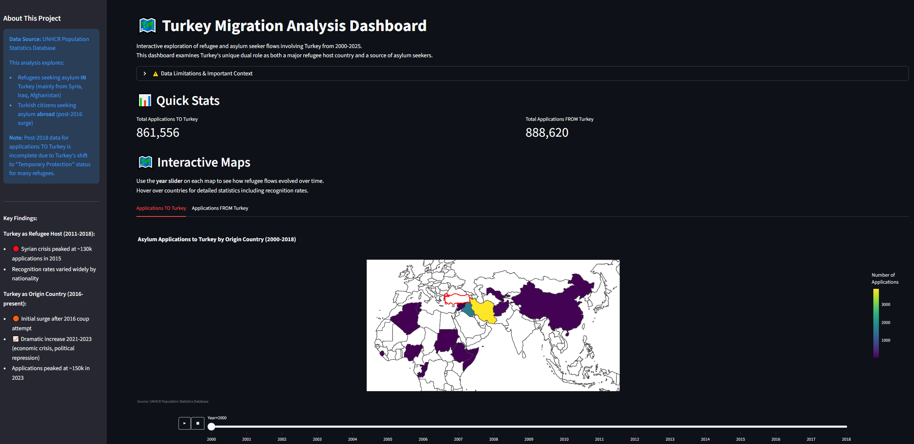

# 🗺️ Turkey Asylum Analysis

An interactive data analysis project examining Turkey's dual role as both a major refugee host country and a source of asylum seekers (2000-2025).



## 📊 Project Overview

This project analyzes UNHCR asylum application and decision data to explore refugee and asylum seeker flows involving Turkey over 25 years. The analysis reveals Turkey's unique position in global migration patterns, serving simultaneously as:

- **A major refugee host** - Particularly during the Syrian crisis (2011-2015)
- **A source of asylum seekers** - With a dramatic surge following the 2016 coup attempt and subsequent political/economic developments

## ✨ Key Features

- **Interactive Choropleth Maps** - Year-by-year animated visualizations showing refugee movements with country-level detail
- **Statistical Analysis** - Recognition rates, application volumes, and temporal trends across 25+ years
- **Live Dashboard** - Streamlit-powered interactive exploration tool with filters and detailed breakdowns
- **Comprehensive Documentation** - Fully documented Jupyter notebooks covering data cleaning, analysis, and visualization

## 🎯 Live Demo

**[View Interactive Dashboard](https://turkey-asylum-analysis-97r3muw7kmhy7iycvs4fyn.streamlit.app/)**

Explore the data yourself with interactive maps, year sliders, and detailed statistical breakdowns.

## 📈 Key Findings

### Turkey as Refugee Host (2011-2018)
- Syrian crisis peaked at ~130,000 applications in 2015
- Afghanistan, Iraq, and Iran were top origin countries
- Recognition rates varied widely by nationality

### Turkey as Origin Country (2016-present)
- Initial surge after 2016 coup attempt
- Dramatic increase 2021-2023 driven by economic crisis, political repression, and deteriorating rule of law
- Applications peaked at ~150,000 in 2023
- Germany, France, and Greece were top destination countries

### Data Limitations
Post-2018 data for applications TO Turkey is incomplete due to Turkey's shift to "Temporary Protection" status for many refugees (particularly Syrians). Turkey currently hosts ~3.6 million Syrian refugees under this status, not reflected in formal UNHCR asylum statistics.

## 🗂️ Project Structure
```
turkey-asylum-analysis/
├── data/
│   ├── raw/                    # Original UNHCR CSV files
│   └── clean/                  # Processed datasets
├── notebooks/
│   ├── 01_data_exploration_and_cleaning.ipynb
│   ├── 02_analysis.ipynb
│   └── 03_interactive_visualization.ipynb
├── utils/
│   ├── config.py              # Centralized paths and configuration
│   └── map_functions.py       # Reusable map creation functions
├── visualizations/
│   ├── applications_to_turkey_map.html
│   ├── applications_from_turkey_map.html
│   └── *.png                  # Static analysis figures
├── dashboard.py               # Streamlit dashboard application
└── README.md
```

## 🚀 Installation & Usage

### Prerequisites
- Python 3.10+
- uv package manager (or pip)

### Setup

1. **Clone the repository**
```bash
git clone https://github.com/oganbayril/turkey-asylum-analysis.git
cd turkey-asylum-analysis
```

2. **Install dependencies**
```bash
# Using uv
uv sync

# Or using pip
pip install -r requirements.txt
```

3. **Run Jupyter notebooks**
```bash
jupyter notebook
```

Navigate to `/notebooks` and run them in order (01 → 02 → 03)

4. **Run the dashboard locally**
```bash
streamlit run dashboard.py
```

## 📊 Data Source

**UNHCR Population Statistics Database** (via Humanitarian Data Exchange)
- Asylum applications and decisions data (2000-2025)
- Covers 4 datasets: applications to/from Turkey, decisions by Turkey/other countries
- Available at: https://data.humdata.org/dataset/unhcr-population-data-for-tur

## 🛠️ Technologies Used

- **Python 3.10+** - Core language
- **Pandas** - Data manipulation and analysis
- **Plotly** - Interactive choropleth maps
- **Matplotlib & Seaborn** - Statistical visualizations
- **Streamlit** - Interactive dashboard framework
- **Jupyter** - Analysis notebooks

## 🔮 Future Enhancements

- Time series forecasting (ARIMA) for application trends
- Demographic breakdown analysis (if data becomes available)
- Comparison with other major refugee host countries
- Flow map visualizations showing migration routes

## 📝 License

This project is licensed under the MIT License - see the [LICENSE](LICENSE) file for details.

## 🙏 Acknowledgments

- UNHCR for providing comprehensive refugee statistics
- Humanitarian Data Exchange for data accessibility

---

Created by [oganbayril](https://github.com/oganbayril)